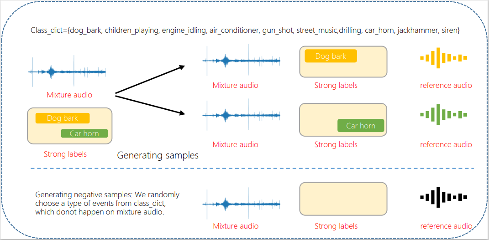

## Inroduction
This is the source code of "Detect what you want: Target Sound Detection", we have submit this paper to ICASSP2022,  you can find our paper on <a>https://arxiv.org/abs/2112.10153</a>
### first step ---> data process
The process of getting data, as Figure 1 shows:

Please first download the Urbansound-sed dataset and Urbansound8K dataset.  
After that, please run the following commond: 
python data/extract_feature.py  
<strong> if a mixture audio include N envents, so that we can generate N samples.
sample style： filename_event  target_event   mel_feature  time
eg.  soundscape_test_bimodal0_gun_shot.wav  gun_shot  [[0,1],[1,1]]   [[],[]]
</strong>
In our experiments, we randomly choose embedding according to class name.

you can also use the feature we extracted, please download it from google dirve <a>https://drive.google.com/drive/folders/1oMfoDX_UQgalKMQstUx3D8kSwOvP8KXz?usp=sharing</a>. you only need to place the feature file to correct path, then you can run it.
### How to run code
bash bash/tsd.sh

### Join train
please run bash/jtsd.sh

### TO do list
We will upload our extracted feature and trained model in the future.  
We only realease the fully supervised training code, the weakly training code is similar with this. If you need it, please let me known.

### reference
https://github.com/RicherMans/CDur
https://www.kaggle.com/adinishad/urbansound-classification-with-pytorch-and-fun
https://github.com/qiuqiangkong/audioset_tagging_cnn
